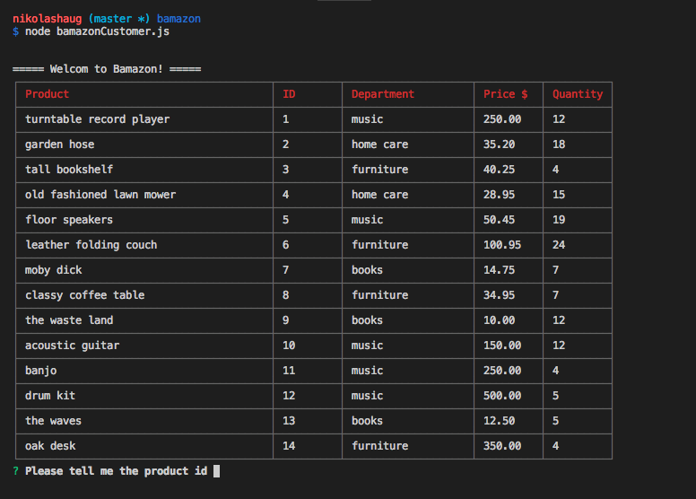

## bamazon marketplace

This is a command line application that replicates an Amazon-like storefront for the user.

The products and their respective prices, quantities, IDs, and department locations are all stored in a MySQL database.

There are two diferent levels, or iterations of this storefront/marketplace:

* Customer view

* Manager view

The Customer view allows users to view and purchase available products from the databse.

The Manager view allows an admin to view and update the products in the database (stock quantity etc.).

### Technologies used:

* node.js

* MySQL

* npm packages: inquirer, mysql, cli-table (prettify)

## Application overview:

### bamazonCustomer.js

