## bamazon marketplace

This is a command line application that replicates an Amazon-like storefront for the user.

The products and their respective prices, quantities, IDs, and department locations are all stored in a MySQL database.

There are two diferent levels, or iterations of this storefront/marketplace:

* Customer view

* Manager view

The Customer view allows users to view and purchase available products from the databse.

The Manager view allows an admin to view and update the products in the database (stock quantity etc.).

### Technologies used:

* node.js

* MySQL

* npm packages: inquirer, mysql, cli-table (prettify)

## Application overview:

### bamazonCustomer.js

The user is prompted with a cli-table of the available products and their prices, quantities, and department names.

They are asked to enter a valid product ID and a desired quantity.

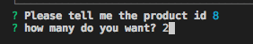

The order is placed and they are shown a receipt of their purchase.

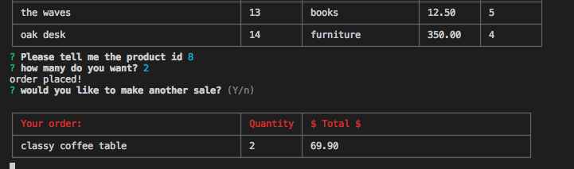

The stock quantity of the chosen product is updated in the database.

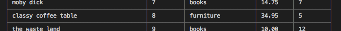

The user is then prompted if they would like another sale. If yes, the products table is displayed again. If no, they exit the application.

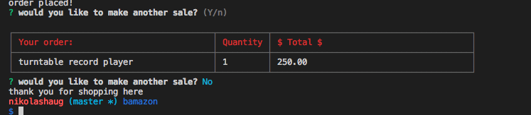

### bamazonManager.js

The admin/user is prompted with a menu of choices.

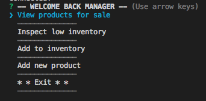

"View products for sale" displays the table of all products in the database, despite their availability.

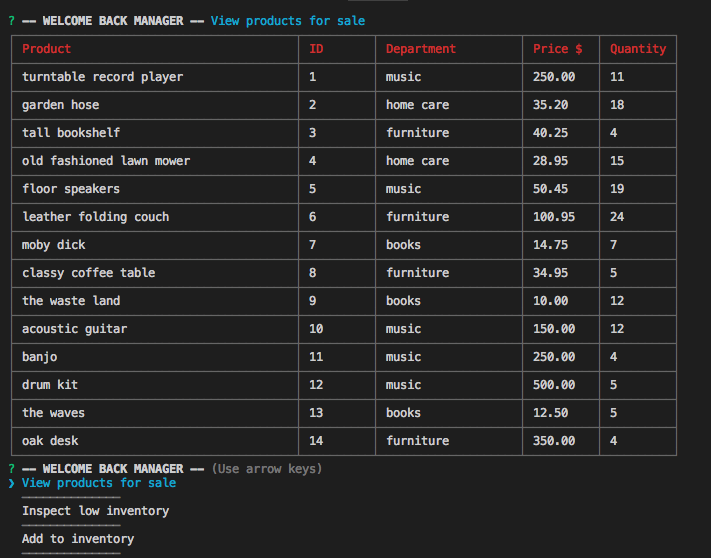

"Inspect low inventory" displays a table of all products with a stock quantity value lower than 5.

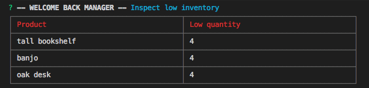

"Add to inventory" displays a list of all products.

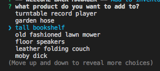

After selecting a product, the admin/user is prompted for a quantity to add (a valid number).

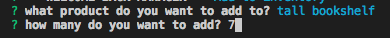

The selected product's stock quantity is updated in the database.

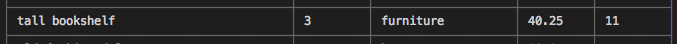

"Add new product" prompts the admin/user for all product details.

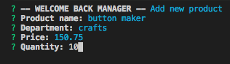

The new product is then added to the database.

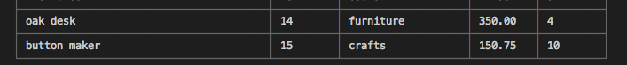

"Exit" logs the admin/user out of (exits) the application.

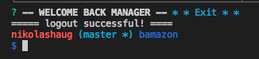